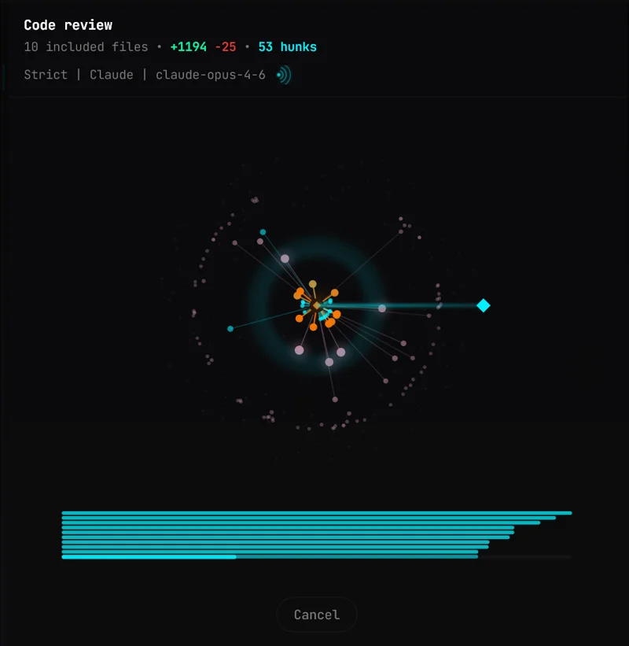
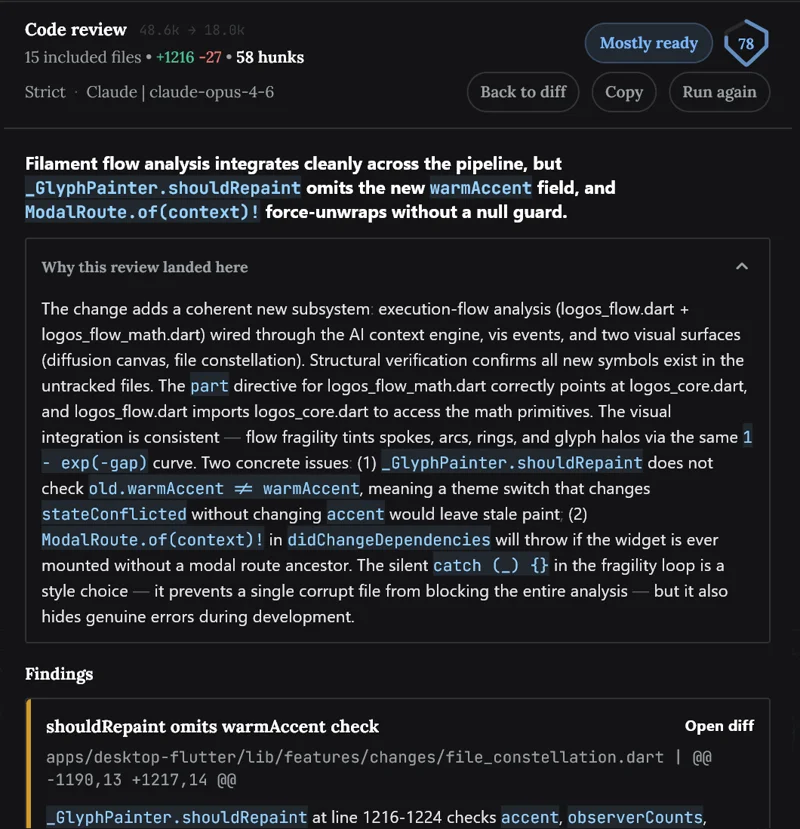
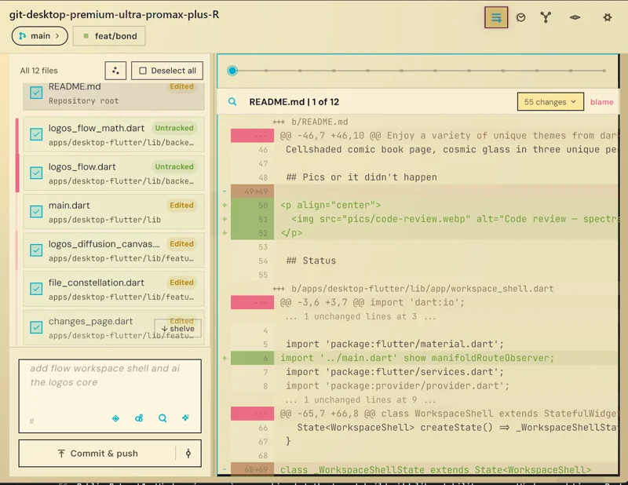
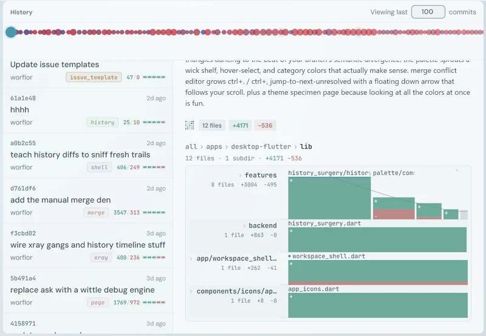
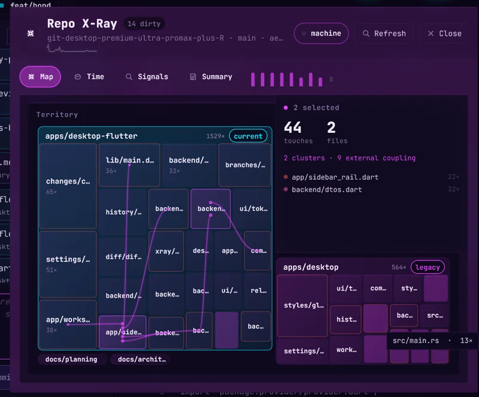
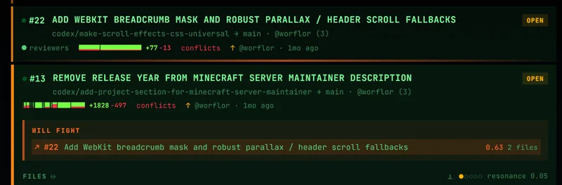
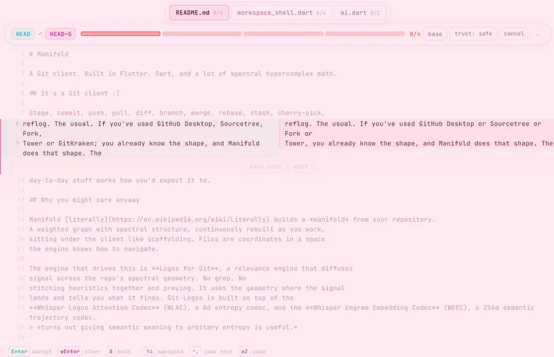
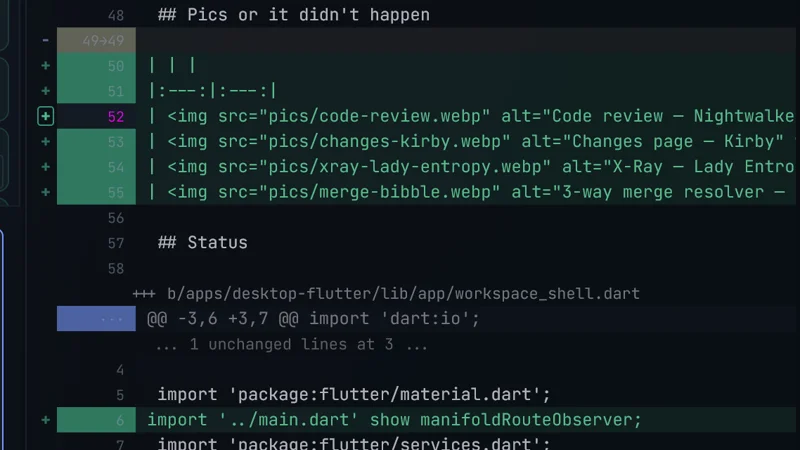

# Manifold

A Git client. Built in Flutter, Dart, and a lot of spectral hypercomplex math.

## It's a Git client :]

Stage, commit, push, pull, diff, branch, merge, rebase, stash, cherry-pick,
reflog. The usual. If you've used GitHub Desktop, Sourcetree, Fork,
Tower or GitKraken; you already know the shape, and Manifold does that shape. The
day-to-day stuff works how you'd expect it to.

## Why you might care anyway

Manifold [literally](https://en.wikipedia.org/wiki/Literally) builds a *manifold* from your repository.
A weighted graph with spectral structure, continuously rebuilt as you work,
sitting under the client like scaffolding. Files are coordinates in a space
the engine knows how to navigate.

The engine that drives this is **Logos for Git**, a relevance engine that diffuses
signal across the repo's spectral geometry. No grep. No
stitching heuristics together and praying. It asks the geometry where the signal
lands and tells you what it finds. Git-Logos is built on top of the
**Whisper Logos Attention Codec** (WLAC), a 0d entropy codec, and the **Whisper Engram Embedding Codec** (WEEC), a 256d semantic trajectory codec. 
> *turns out giving semantic meaning to arbitary entropy is useful.*

What that looks like in practice:

- Manifold can map your diff to external file context automatically using repo history, the spectral graph, and the source's logistical operations and flow itself.
  - Use non-agentic LLM-powered Review Commit with logos-backed context gathering. Cheap, efficient, thorough.
- Open any file. The client already knows what it connects to, how tightly, and through which channels.
- View changes by *geometric Atlas* rather than by file.
- PRs, worktrees, and branches have **Orbits**.
- See through a repo with X-Ray. Trace a feature across the tree. Find a file's
  structural siblings. Surface hotspots or keystone files.

Oh yeah, and it's *free* ♥

### ...in monke terms..?

*monke add repo. repo get analyzed. monke see where banana generater was added vs banna VIEWER (monke doesnt add descriptions. too busy making banana generators in different languages). friend send monke spaghetti repo when monke prefer banana repo. Manifold show monke around the new repo as if monke's own repo. spaghetti turned lasagna. all with manifold*

## Mine, and yours

Enjoy a variety of unique themes from dark and mysterious Loverboy to a Claude inspired "Halo". Show off that you earned your fairy wings with Bibble or forget the world like a Nightwalker.

Cellshaded comic book page, cosmic glass in three unique perspectives... you get the point.

## Pics or it didn't happen

| | |
|:---:|:---:|
|  |  |
|  |  |
|  |  |
|  |  |

## Status

Public Beta mk1. Windows is my primary machine but the target builds i'd like stability on are Windows and Linux. Portable exe and AppImage.

## Quick start

```bash
cd apps/desktop-flutter
flutter pub get
flutter run -d windows
```

Needs Flutter 3.22+, Dart 3.3+, and Git on your PATH.

## On the code, openly

Manifold is open source. yippee!!! Use it as your daily driver if it clicks for you.
Fork it, lift pieces for your own projects, audit it, whatever helps. If it
ends up being the Git client someone actually reaches for, that's great.

Issues are welcome. Bug reports, questions, "this broke", "this is
confusing", "X seems wrong" - all of that is useful, and I'll get to it
when I can.

Clone it, or ask an LLM to explain and understand the core. I support self learning. But...

Pull requests touching the engine *aren't* preferred, and this isn't a community thing. The math underneath Manifold is specific, layered, and easy to break in ways that don't look broken. 
The engine mixes:

- hypercomplex algebra
- spectral graph theory: Laplacian, heat kernel, & Ricci flow.
- chemistry-flavoured structural analogies. coupling, diffusion, phase
  transitions on the repo graph
- **kizuna math**, a term I coined for a particular flavor of
  higher-dimensional hypercomplex algebra I use across my projects.
  Manifold leans on parts of it, alongside everything else above.

PRs that touch the engine tend to violate invariants that look fine at
code review but quietly wreck properties the rest of the system depends
on. Unwinding that eats the time I'd rather spend *not*. So read it,
fork it, yoink from it, file issues, fix issues I haven't experienced yet. Just not vibe-understood PRs or I'll vibe-respond.

## License

See [LICENSE](LICENSE). WLAC and WEEC ship under the same Free License I hold the
rights to.

## Acknowledgments

Flutter. Dart. The math nerds. The GloVe authors. Everyone whose work I
stood on.
