# Manifold

A cross-platform desktop Git client for Windows and Linux. Built in Flutter, Dart, and a lot of spectral hypercomplex math.

<p align="center">
  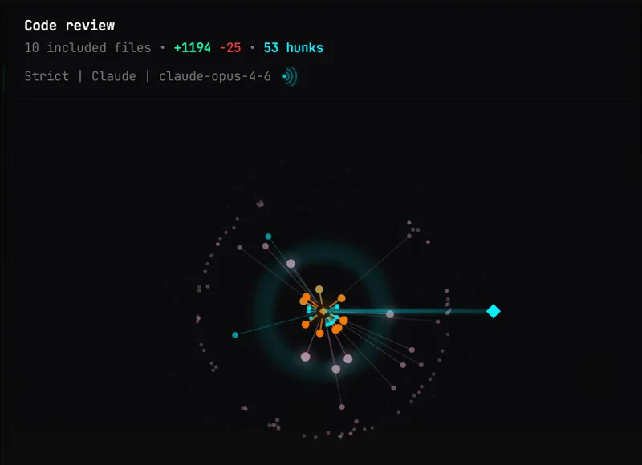
</p>

> Manifold is a free, open source Git client for Windows and Linux with a spectral engine (Logos) that reads your commit history as a graph of how files couple, then uses it for merge conflict prediction, grounded AI code review, and codebase maps. Works with GitHub, GitLab, and self-hosted Gitea, or fully offline with local-first pull requests and issues that need no remote.

## It's a Git client :]

Stage, commit, push, pull, diff, branch, merge, rebase, stash, cherry-pick,
reflog. The usual. If you've used GitHub Desktop, Sourcetree, Fork,
Tower or GitKraken; you already know the shape, and Manifold does that shape, an open source alternative to them all. The
day-to-day stuff works how you'd expect it to.

Works with GitHub, GitLab (including self-hosted), and Gitea, syncing PRs and issues both ways. Or go local-first: with no remote at all, PRs and issues still live inside the repo, fully offline.

## Why you might care anyway

Manifold [literally](https://en.wikipedia.org/wiki/Literally) builds a *manifold* from your repository.
A weighted graph with spectral structure, continuously rebuilt as you work,
sitting under the client like scaffolding. Files are coordinates in a space
the engine knows how to navigate.

Driving this is **Logos for Git**, a relevance engine that diffuses
signal across the repo's spectral geometry. No grep. No
stitching heuristics together and praying. It asks the geometry where the signal
lands and tells you what it finds. Git-Logos is built on top of the
**Whisper Logos Attention Codec** (WLAC), a 0d entropy codec, and the **Whisper Engram Embedding Codec** (WEEC), a 256d semantic trajectory codec. 
> *turns out giving semantic meaning to arbitrary entropy is useful.*

What that looks like in practice:

- Manifold can map your diff to external file context automatically using repo history, the spectral graph, and an experimental execution flow engine; Filament.
  - It feeds LLM-powered Code Review, Muse Brainstorming, and Generate Message, all with *logos-backed* context. The one-shot gather stays cheap and fast, and a new optional read-only agentic harness explores outward from what Logos surfaces. It piggybacks Codex, so Codex and API models can go agentic (Claude Code can't host the harness, so it stays one-shot there).
- Open any file. The client already knows what it connects to, how tightly, and through which channels.
- View changes by *geometric Atlas* (preview) rather than by file.
- PRs, worktrees, and branches get **Orbits**, orbital shapes drawn from the coupling graph, so related branches surface as merge risk even when they aren't touching the same files.
- See through a repo with X-Ray. Trace a feature across the tree. Find a file's
  structural siblings. Surface hotspots or keystone files.
- Bring your own model. Route the AI features through Cursor, Copilot, Codex, OpenRouter, or opencode.
- Plus the stuff a mature client needs: a scrubbable history timeline (Orrery, preview), image, video, and binary diffs, and a command palette tying it together.

Oh yeah, and it's *free* ♥

### ...in monke terms..?

*monke add repo. repo get analyzed. monke see where banana generater was added vs banna VIEWER (monke doesnt add descriptions. too busy making banana generators in different languages). friend send monke spaghetti repo when monke prefer banana repo. Manifold show monke around the new repo as if monke's own repo. spaghetti turned lasagna. all with manifold*

Translation for the humans and the robots: Manifold hands you the lay of the land in a repo you didn't write, before you open a single file.

## Pics or it didn't happen

Every shot below is in a different theme. And that's only a fraction of them.

### The engine, made visible

<table>
<tr>
<td align="center" width="50%">
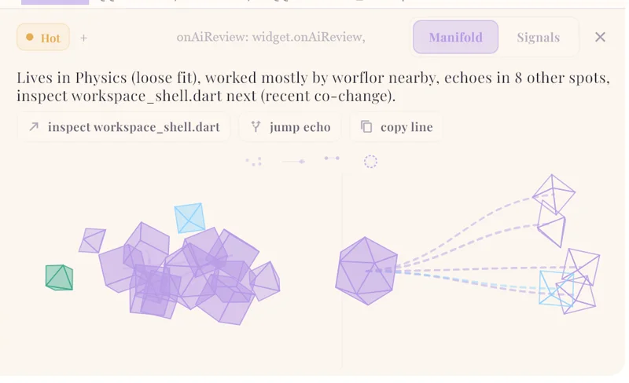<br>
<sub><b>Your repo as geometry.</b> files are shapes, co-change is distance · Nacre</sub>
</td>
<td align="center" width="50%">
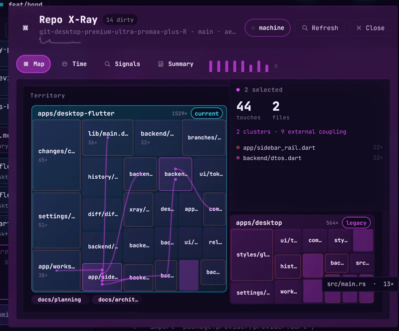<br>
<sub><b>X-Ray the whole repo.</b> clusters, hotspots, keystone files, external coupling · Lady Entropy</sub>
</td>
</tr>
<tr>
<td align="center" width="50%">
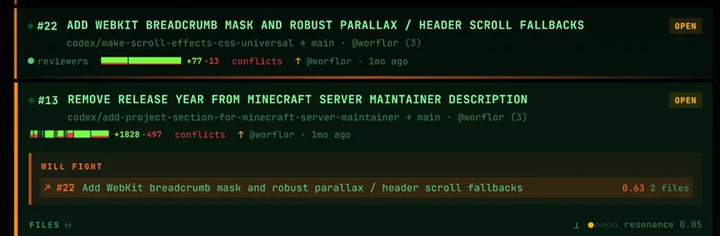<br>
<sub><b>PRs as orbits.</b> Manifold knows which branches will fight before you merge · Phosphor</sub>
</td>
<td align="center" width="50%">
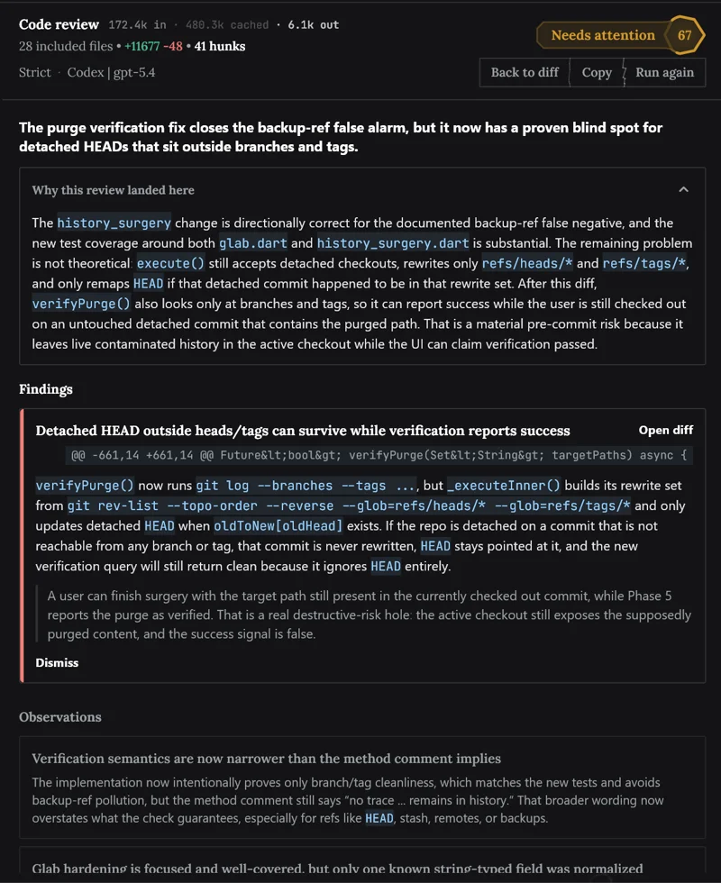<br>
<sub><b>The verdict, with receipts.</b> findings that point at the exact signal that found them · Blackboard</sub>
</td>
</tr>
</table>

<p align="center">
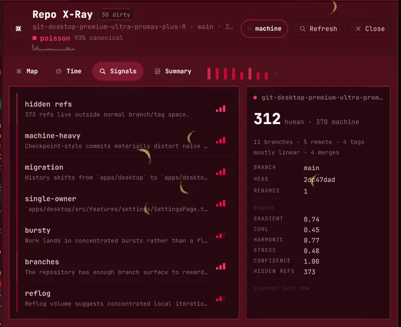<br>
<sub><b>Signals: the repo's character, made legible.</b> commit rhythm, machine noise, hidden refs, the quirks that make it itself · Redshift</sub>
</p>

### The everyday client

<table>
<tr>
<td align="center" width="50%">
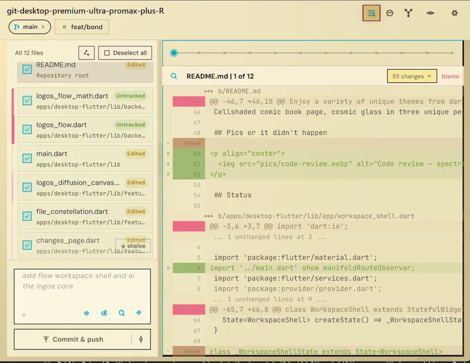<br>
<sub><b>The everyday loop.</b> stage, write, commit, with the engine mapping your diff underneath · Kirby</sub>
</td>
<td align="center" width="50%">
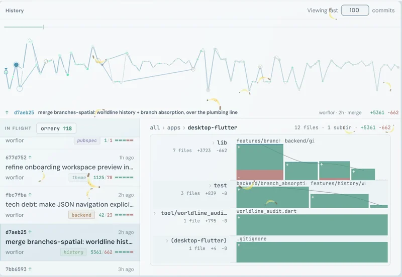<br>
<sub><b>History as a seismograph and worldline.</b> importance, churn, and branches woven into one thread. · Petrichor</sub>
</td>
</tr>
<tr>
<td colspan="2" align="center">
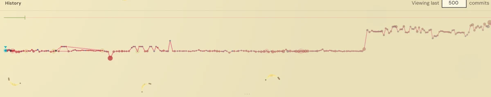<br>
<sub><b>Zoom all the way out.</b> a repo's entire history as one strand, from calm stretches to storms · Kirby</sub>
</td>
</tr>
<tr>
<td align="center" width="50%">
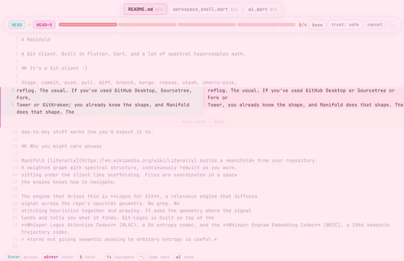<br>
<sub><b>Three-way merges, fullscreen and per-file.</b> built for The Manual Way™ · Bibble</sub>
</td>
<td align="center" width="50%">
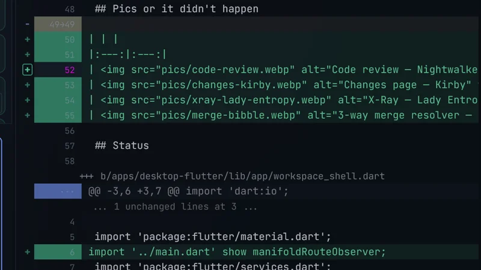<br>
<sub><b>Line-level staging.</b> split a hunk down to just the lines that belong · Aether</sub>
</td>
</tr>
<tr>
<td align="center" width="50%">
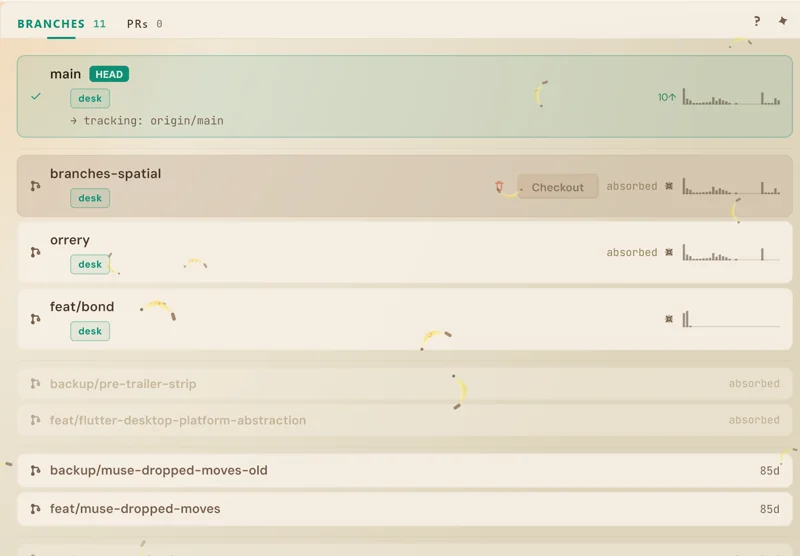<br>
<sub><b>Branches, understood.</b> it tells absorbed from squashed from merged · Helix</sub>
</td>
<td align="center" width="50%">
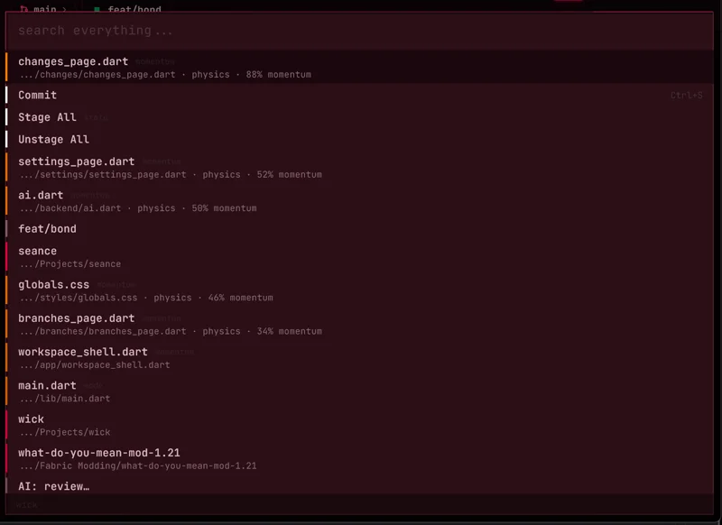<br>
<sub><b>One palette for everything.</b> repos, files, actions. Right there · Redshift</sub>
</td>
</tr>
</table>

## Mine, and yours

Enjoy a variety of unique themes from dark and mysterious Loverboy to a Claude inspired "Halo". Show off that you earned your fairy wings with Bibble or forget the world like a Nightwalker.

Cellshaded comic book page, cosmic glass in three unique perspectives... you get the point.

## Reach for it when you're...

- **onboarding into an unfamiliar codebase.** X-Ray builds a map from the history: which files cluster, which are hotspots, which one file everything secretly leans on.
- **tired of merge conflicts ambushing you.** Orbits is merge conflict prediction: it calls which branches will collide before you press merge.
- **after AI code review that actually knows your repo.** Reviews are grounded in the coupling graph, not grep, with an optional read-only agentic mode.
- **on self-hosted GitLab or Gitea.** Two-way PR and issue sync, same as GitHub. No remote at all? They still work, stored right in the repo.
- **living in a large, fast-moving repo.** Line-level staging, parallel worktrees, full undo on destructive operations, and a commit graph you can zoom until 500 commits read like weather.

## Questions you might have

**Is it free?** Yes, completely. Free and open source, no account required.

**Does it work offline, without a remote?** Yes. PRs and issues live inside the repo as orphan refs, so it is fully local-first. Push whenever you feel like it.

**Which AI models can it use?** Yours. Cursor, Copilot, Codex, OpenRouter, or anything through opencode. The agentic review mode is read-only: it looks everywhere and changes nothing.

**How is it different from GitKraken or GitHub Desktop?** They show you your repo. Manifold has done the math on it: it predicts merge conflicts, grounds AI review in your real coupling structure, and can map a codebase you have never seen.

## Status

Public Beta mk2. Windows is my primary machine but the target builds i'd like stability on are Windows and Linux. Portable exe and AppImage.

## Quick start

```bash
cd apps/desktop-flutter
flutter pub get
flutter run -d windows
```

Needs Flutter 3.35+, Dart 3.9+, and Git on your PATH.

## On the code, openly

Manifold is open source. yippee!!! Use it as your daily driver if it clicks for you.
Fork it, lift pieces for your own projects, audit it, whatever helps. If it
ends up being the Git client someone actually reaches for, that's great.

Issues are welcome. Bug reports, questions, "this broke", "this is
confusing", "X seems wrong" - all of that is useful, and I'll get to it
when I can.

Clone it, or ask an LLM to explain and understand the core. I support self learning. But...

Pull requests touching the engine *aren't* preferred, and this isn't a community thing. The math underneath Manifold is specific, layered, and easy to break in ways that don't look broken. 
The engine mixes:

- hypercomplex algebra
- spectral graph theory: Laplacian, heat kernel, & Ricci flow - because signal travels through a repo the way heat diffuses through a structure
- chemistry-flavoured structural analogies. coupling, diffusion, phase
  transitions on the repo graph
- **kizuna math**, a term I coined for a particular flavor of
  higher-dimensional hypercomplex algebra I use across my projects.
  Manifold leans on parts of it, alongside everything else above.

PRs that touch the engine may violate invariants that look fine in
code review but quietly wreck properties the rest of the system depends
on. Unwinding that eats the time I'd rather spend *not*. So read it,
fork it, yoink from it, file issues, fix issues I haven't experienced yet. Just not vibe-understood PRs or I'll vibe-respond.


## Known Things

- Runs hot 👉👈 (hot math ayo)
- Loading a huge, MANY-gb file still causes big issues. on the list.

## License

See [LICENSE](LICENSE). WLAC and WEEC ship under the same Free License I hold the
rights to.

## Acknowledgments

Flutter. Dart. The math nerds. The GloVe authors. Everyone whose work I
stood on.
